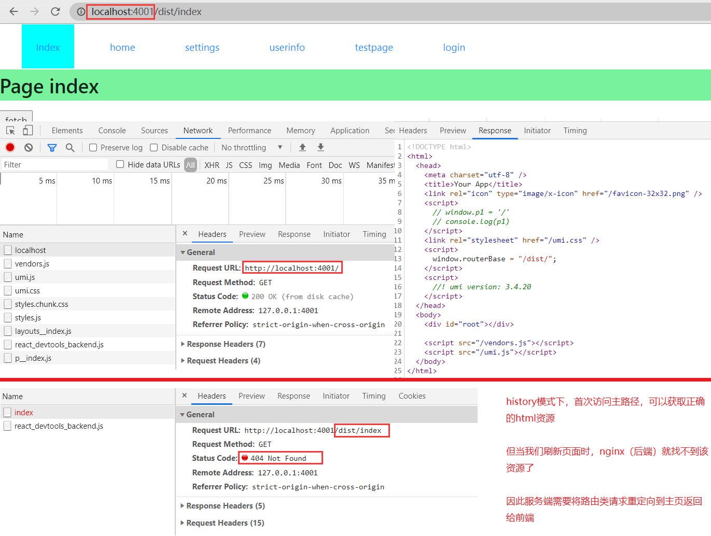

# umi test project
目标：整理出一般项目常用配置项，下载即可直接使用

具体操作：对umi配置的实践，整理新手常见的问题

项目已实践内容：
1. ie10+ 的验证 （dev、prop）
2. 资源懒加载   （dev、prop）
3. 公共资源抽取 （dev、prop）
4. mock配置
5. 不同环境config实践

ie问题：
1.打包的ie9会提示不支持WebSocket
2.dev环境下会报语法错误，devScripts.js (25,5)

## Getting Started

Install dependencies,

```bash
$ yarn
```

Start the dev server,

```bash
$ yarn start
```

## 生产环境配置

umi config 配置为
```
{
  base: '/',        // 服务器的某个文件夹下，可以根据实际情况设置，例如该静态资源部署在服务器根目录的front文件夹下，则应配置为 /front/
  publicPath: '/',  // 文件引用位置，改为相对路径 './' 打包后的资源引用可能出问题（开启dynamicImport后，嵌套路由资源打包为一级资源，但是打包代码中请求该资源的时候多加了一层目录，导致子路由无法获取相关js），原因有待进一步研究
}
```

路由为history模式时候，需要处理静态资源请求

```
server {
    listen        4001;
    server_name   localhost;

    # 简单过滤了资源文件，带 '.' 的资源正常的在dist目录下找
    location ~ \. {
        root D:/my-umi-test/dist/;
        index index.html;
    }
    # 其他资源默认为路由类，根据项目情况可以用正则匹配出api,assets等具体资源
    location / {
        root D:/my-umi-test/dist/;
        index index.html;
        # 关键内容，当页面在其他路由位置刷新时，nginx找不到对应文件的情况下会尝试返回主页
        try_files $uri $uri/ /index.html;
    }
}
```
